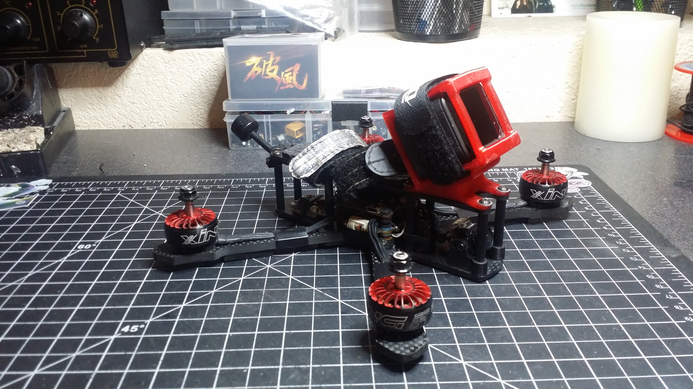

### @FilThrillz
https://www.youtube.com/channel/UCak9tzIVFJdci3hAwNphVnw

Preset Name (Helio): `5inch-4S-2207-2750KV-FilThrillz-freestyle`

Spec:
- Activate FPV Stella 5 inch Frame
- Mode2 FLUX FC
- RDQ Mach1 VTX
- Hobbywing 60a 4 in 1 ESC's
- XING 2207-2750kv Motors
- Foxeer Falcor Micro camera
- LemonRX DSMX Satellite RX
- Lumnier AXII 5.8 VTX Antenna
- Tmotor PROP T5143
- Ovonics 1300Mah 100C Packs
- Gopro Session 5

Reason behind tune:
I tuned it this way to correlate to my flight style and stick feel. I didn't mess too much with pids and filtering because I've always thought that anything default is as close as you can get to a perfect flight experience out the box. I had my share of spending too much time tuning and not flying. I'd rather be spending more time flying than tuning. And thats my idea behind my tune.

WARNING: End-Users, please be extra cautious for motor-heat due DTerm 55.

