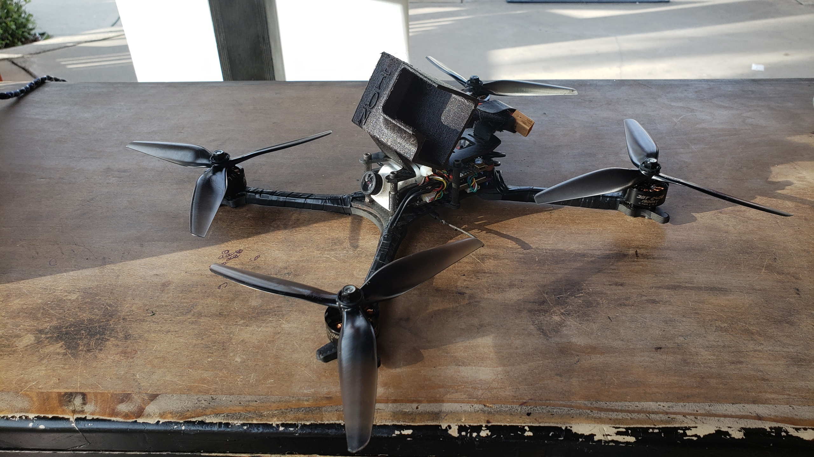

### @Skylion
https://www.youtube.com/c/skylionfpv

Preset Name (Helio): `7inch-4S-2408-1900KV-Skylion`

Spec:
- Prototype Floss Frame
- Helio Spring
- 3BT 2408 1900kv
- HQ 7x4x3
- 713g AUW

[This frame] was never actually released, but it's a prototype floss, was created somewhere between the floss 1 and floss 2, intended to have the battery toilet tanked on top. I call it the flossHD. Since [Kabab] had the SSEvoHD and with 5" arms it's the exact same geometry as the hyperlite superstretch from 2017/2018ish

