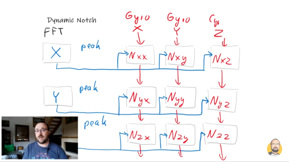

## Matrix gyro Filter
* The gyro Dynamic_Filter in EmuFlight 0.3.X (a.k.a. Matrix) is a per-axis dynamic gyro notch written by [Paweł Spychalski](https://www.youtube.com/c/Pawe%C5%82Spychalski/search?query=matrix%20filter).

### Tuning
* EmuFlight stock defaults are fair for a 5" standard-frame quadcopter, but generally over-filter.
* Defaults have Matrix enabled as well as 2 dTerm LPF's, which again may be overfiltering. (Helio is disabled by default.)
* The goal of filter tuning is to have a quad-specific tune that is neither over-filtered nor under-filtered.

### Many options (0.3.X)
* Often it is found that with Matrix enabled, only one dTerm LPF is required.
* Often it is found that with Matrix disabled, two dTerm LPF's are required. (But this may vary, especially on Helio/Strix.)
* Matrix may placed over the motor-noise spikes to remove dTerm noise from gyro; However,
* Matrix may also be placed above motor-noise spike to clean-up only high frequency noise.

### Variables and Values
* Matrix Q (`dynamic_gyro_notch_q`) is the width of the dynamic per-axis notches. Higher value is a narrower notch, while smaller values are a wider notch. Range: 1-1000. Default: `300`.
* Smaller values (wider notches) are more latent than larger values (narrower notches).
* Matrix Min (`dynamic_gyro_notch_min_hz`) is the lowest value that a notch's cutoff may exist. Range: 30-1000. Default: `150`.
* Matrix Max (`dynamic_gyro_notch_max_hz`) [0.3.2+ / CLI only] is the highest value that a cutoff may exist. Range: 600-1000. Default: `600`.

***

* Matrix Introduction, by Paweł: https://youtu.be/7s8ZeP135uI
* How it Works, by Paweł: https://youtu.be/w0QsVIXYWCE
